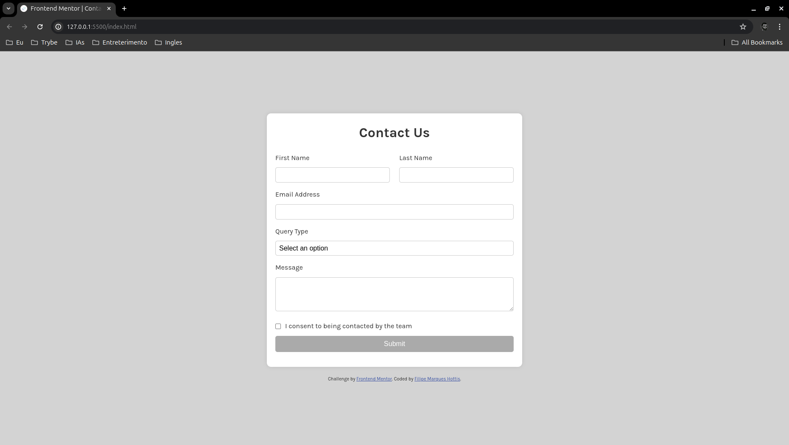
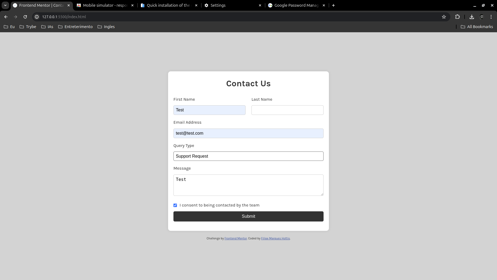
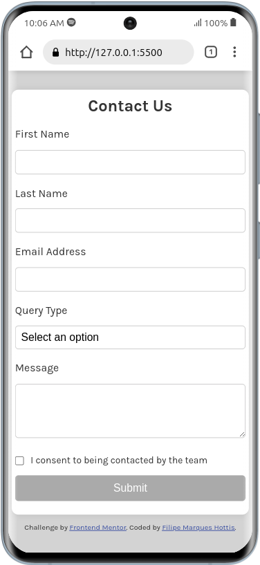

# Frontend Mentor - Contact Form Solution

## Bem-vindo! 👋

Esta é minha solução para o desafio de formulário de contato do [Frontend Mentor](https://www.frontendmentor.io). Esse desafio ajuda a melhorar as habilidades de codificação, construindo projetos realistas.

## Visualização

### Versão Desktop

### Formulário Preenchido (Desktop)

### Versão Mobile

### Comportamento no Mobile (Vídeo)

## Funcionalidades

Os usuários podem:
- Preencher o formulário e ver uma mensagem de sucesso após o envio.
- Receber mensagens de validação se um campo obrigatório for omitido ou se o email não estiver formatado corretamente.
- Navegar e preencher o formulário apenas com o teclado.
- Ter as entradas, mensagens de erro e a mensagem de sucesso anunciadas em seu leitor de tela.
- Visualizar o layout otimizado para o dispositivo dependendo do tamanho da tela.
- Ver estados de foco e hover para todos os elementos interativos na página.

## Acessibilidade

Me preocupei em garantir que o formulário fosse acessível:
- Navegação apenas pelo teclado.
- Atributos ARIA para melhorar a acessibilidade dos leitores de tela.
- Testes com ferramentas de acessibilidade para garantir que todas as mensagens e estados sejam anunciados corretamente.

## Tecnologias Utilizadas

- HTML
- CSS
- JavaScript

## Desafios

Passei mais tempo descobrindo como mudar o comportamento do site ao girar o celular, garantindo que a experiência do usuário fosse suave e intuitiva.

## Como Rodar o Projeto

1. Clone o repositório.
2. Abra o arquivo `index.html` no seu navegador preferido.

## Contato

Se tiver alguma dúvida ou feedback, sinta-se à vontade para entrar em contato!

---

**Divirta-se construindo!** 🚀
